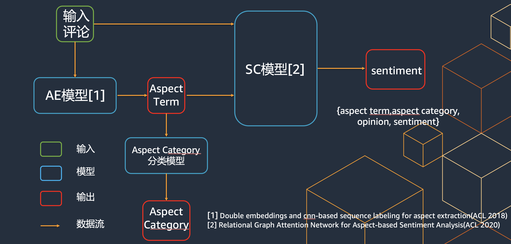
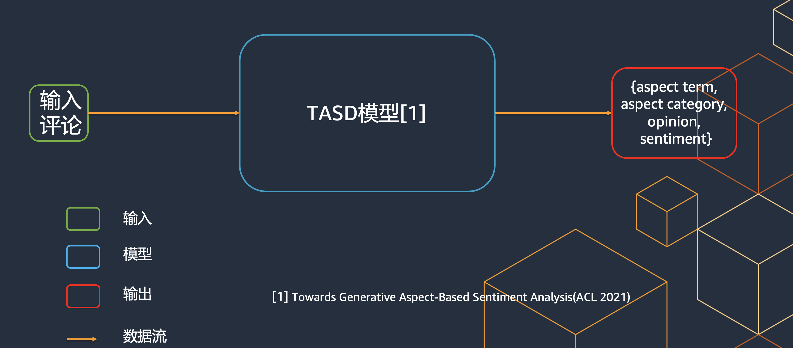

## 使用场景

根据任务定义方式可以分为端到端式ABSA和pipeline式ABSA。

* pipeline式ABSA：通过不同的模型组件分别完成AE,APC等任务后搭建成一个pipeline组合输出。
* 端到端式ABSA：通过一个模型直接完成ABSA所定义的全部或者多个任务。

## pipeline式ABSA

## 端到端式ABSA

## 业内做法
### AE
Aspect term extraction with history attention and selective transformation(IJCAI 2019)
Double embeddings and cnn-based sequence labeling for aspect extraction(ACL 2018)

### SC
Aspect level sentiment classification with deep memory net-work(EMNLP 2016)
Relational Graph Attention Network for Aspect-based Sentiment Analysis(ACL 2020)

### OE
Coupled multi-layer attentions for co-extraction of aspect and opinion terms(AAAI 2017)

### Unified framework 
A unified model for opinion target extraction and target sentiment prediction(AAAI 2019)
An interactive multi-task learning network for end-to-end aspect-based sentiment analysis (ACL 2019)
DOER: dual cross-shared RNN for aspect term-polarity co-extraction (ACL 2019)

### General framework 
Relation-Aware Collaborative Learning for Unified Aspect-Based Sentiment Analysis(ACL 2020)
Towards Generative Aspect-Based Sentiment Analysis(ACL 2021)

