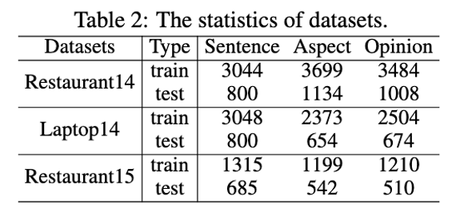
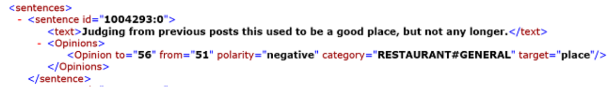

### 1.公开数据集 (英文)及其标注样例

### 2.公开数据集 (中文)

* 北大 (https://github.com/NLPBLCU/Chinese-Multi-Target-Sentiment-Classification-Dataset/blob/master/our_data.7z) 2K条数据，6K个aspect
* 美团 (https://raw.githubusercontent.com/viewlei/fsauor2018/master/src/sentiment_analysis_trainingset_annotations.pdf) 包含105000条训练样本以及15000条测试样本 ，两层aspect共20种aspect, 即传统的多分类问题

