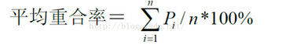
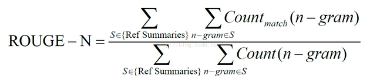

文本生成目前的一大瓶颈是如何客观，准确的评价机器生成文本的质量。自动文档摘要评价方法大致分为两类：

（1）内部评价方法：提供参考摘要，以参考摘要为基准评价系统摘要的质量。系统摘要与参考摘要越吻合，质量越高。

（2）外部评价方法：不提供参考摘要，利用文档摘要代替原文档执行某个文档相关的应用。例如：文档检索、文档分类等，能够提高应用性能的摘要被认为是质量好的摘要。

下面介绍两种比较简单的，经常用到的内部评价方法：

### Edmundson

适于抽取式文本摘要，比较机械文摘(自动文摘系统得到的文摘)与目标文摘(从原文中抽取的句子)的句子重合率的高低对系统摘要进行评价。 

计算公式： 

           重合率p = 匹配句子数/专家文摘句子数*100%

每一个机械文摘的重合率为按三个专家给出的文摘得到的重合率的平均值（其中，pi为相对于第i个专家的重合率，n为专家文摘总数）：

### ROUGE

ROUGE（Recall-Oriented Understudy for Gisting Evaluation）基于摘要中n-gram的共现信息评价摘要，是一种面向n元词召回率的评价方法。

其中，Ref summaries表示标准摘要，count_match(n-gram)表示生成摘要和标准摘要中同时出现n-gram的个数，count(n-gram)表示参考摘要中出现的n-gram个数。