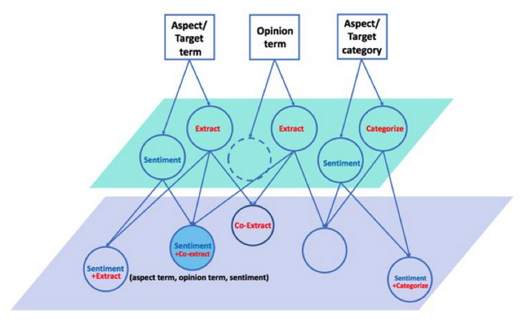

## 细粒度情感分析任务（ABSA）

对于一句餐馆评论：“Waiters are very friendly and the pasta is simply average.”，提到了两个评论目标：“waiter”和“pasta”；用来评价他们的词分别是：“friendly”和“average”；这句话评论的分别是餐馆的“service”和“food”方面。

从目标识别角度，针对 aspect term 和 opinion term，存在抽取问题；针对 aspect category，存在分类问题（假设预定义 aspect categories）。从情感分析角度，对 aspect term 和 aspect category 存在情感分类问题。这些原子任务如下图中间层所示。注意，一句评论里可能没有显示提及 aspect term，但同样可以存在 aspect category，比如“I was treated rudely.”讲的是“service”。