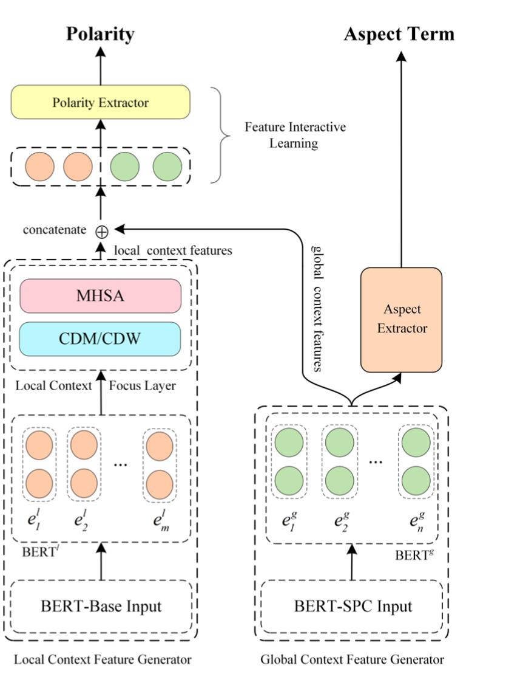
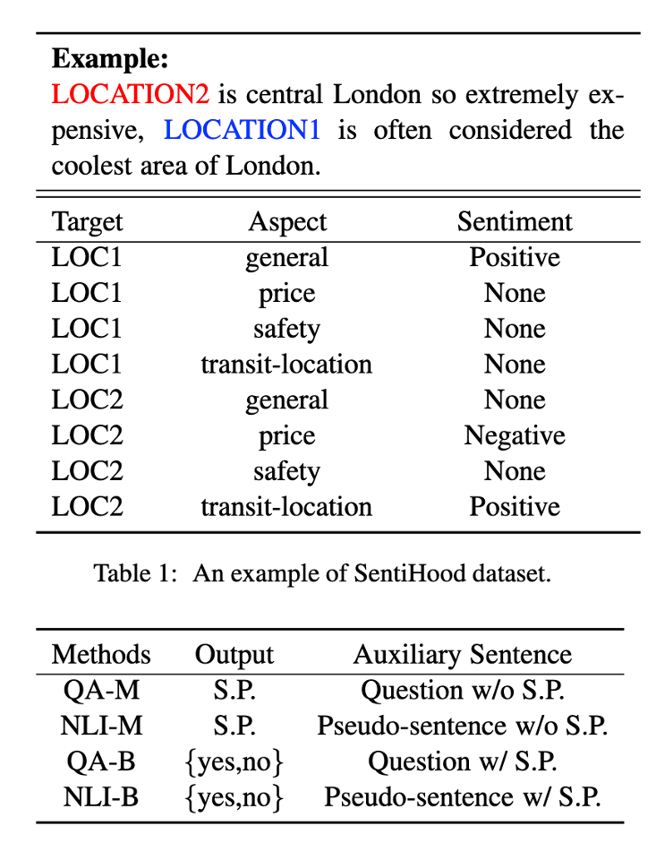

---
title: "动手实验1: 基于Amazon SageMaker训练一个端到端抽取式的ABSA模型"
date: 2021-11-05T14:52:27+08:00
weight: 0260
draft: false
---

### 这里我们使用两种模型作为演示用:

* LCF-ATEPC
paper - A Multi-task Learning Model for Chinese-oriented Aspect Polarity Classification and Aspect Term Extraction。 

* CAS-Bert
paper - Utilizing BERT for Aspect-Based Sentiment Analysis via Constructing Auxiliary Sentence" (NAACL 2019)。 这个方法的输入输出设计很符合TABSA任务，做法简单，适合作为此类任务的baseline.

SOTA for ate task： https://paperswithcode.com/sota/aspect-based-sentiment-analysis-on-semeval?p=a-multi-task-learning-model-for-chinese 
我们现在会用sagemaker进行一个模型的本地训练，使用ml.p3.8xlarge机型。

## LCF-ATEPC

* 核心贡献：

提出局部上下文聚焦（CDM/CDW）机制，使得self-attention得到的特征聚焦于aspect附近

## CAS-Bert

核心思想为将实际标签中的(aspect term, aspect category, sentiment)三元组生成辅助句，然后做输入评论和辅助句的matching，相当于句子级别的分类任务。

以QA-B模式为例：
实际label为(aspect term, aspect category, sentiment)
则对safety这个category生成三句话：
1. the sentiment of the aspect safety of aspect term is positive
2. the sentiment of the aspect safety of aspect term is none
3. the sentiment of the aspect safety of aspect term is negative

然后做实际评论和生成辅助句的分类任务

