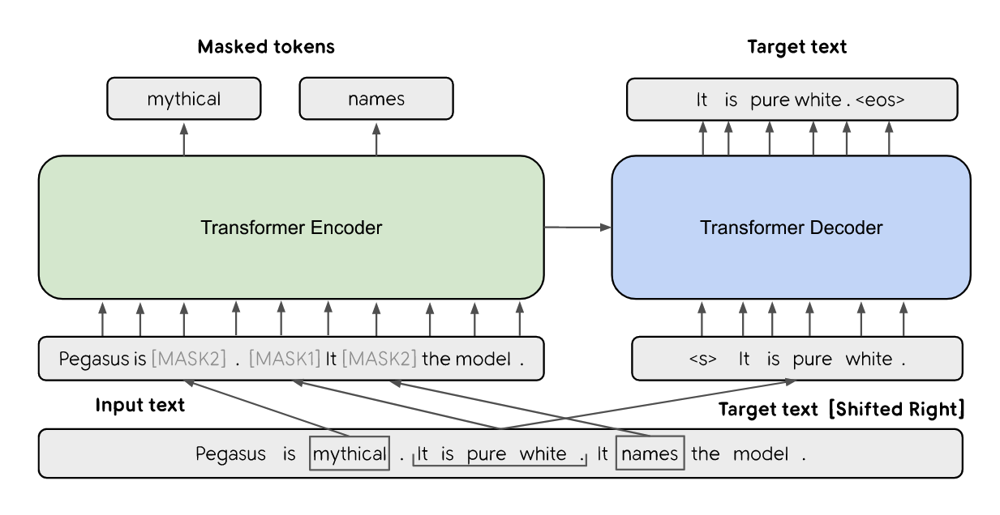
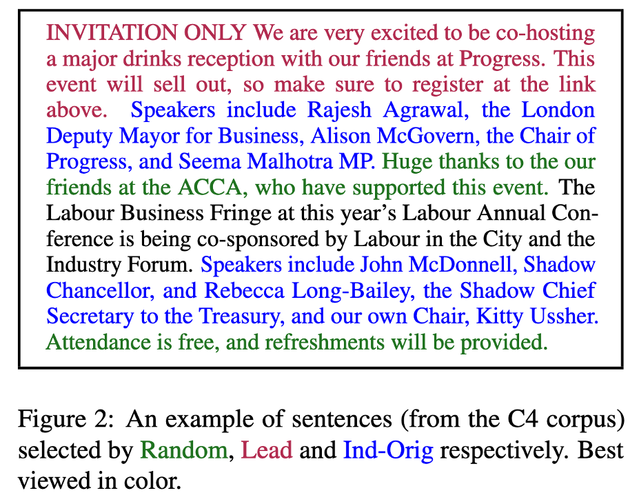
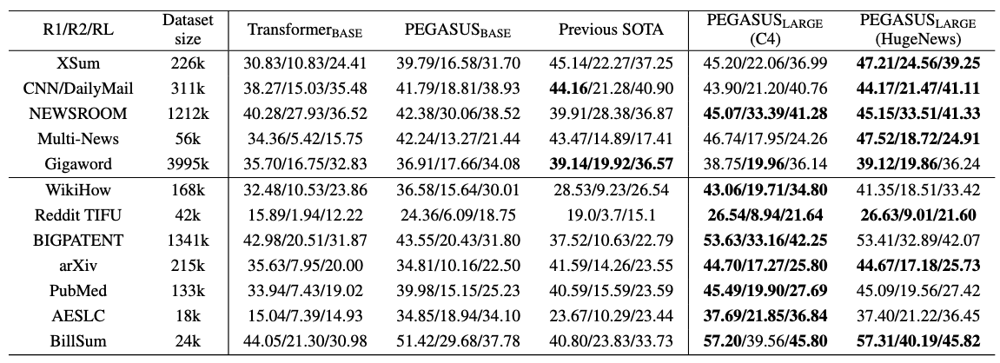
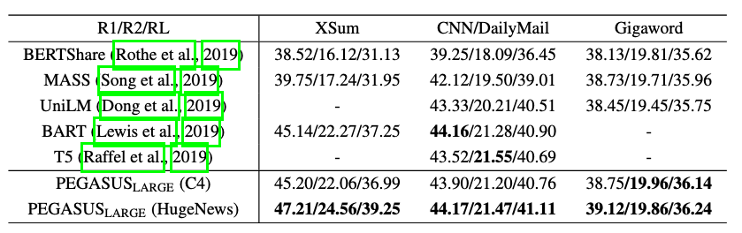

## 模型架构

Pegasus是一个标准的Transformer架构，其全称是：利用提取的间隙句进行摘要概括的预训练模型（Pre-training with Extracted Gap-sentences for Abstractive Summarization）。就是设计一种间隙句生成的自监督预训练目标（GSG），来改进生成摘要的微调性能。

## GSG预训目标

* Mask掉整个句子
* 将Mask的句子拼接成摘要
* 使用上下文补全

Mask策略

## 模型表现

Pegasus-large在各个摘要数据集上的结果同之前的SOTA对比：在所有数据集上均得到了SOTA的性能表现。

## reference

* paper： https://arxiv.org/abs/1912.08777
* source code：https://github.com/google-research/pegasus

@misc{zhang2019pegasus,
    title={PEGASUS: Pre-training with Extracted Gap-sentences for Abstractive Summarization},
    author={Jingqing Zhang and Yao Zhao and Mohammad Saleh and Peter J. Liu},
    year={2020},
    eprint={1912.08777},
    archivePrefix={ICML},
    primaryClass={cs.CL}
}

