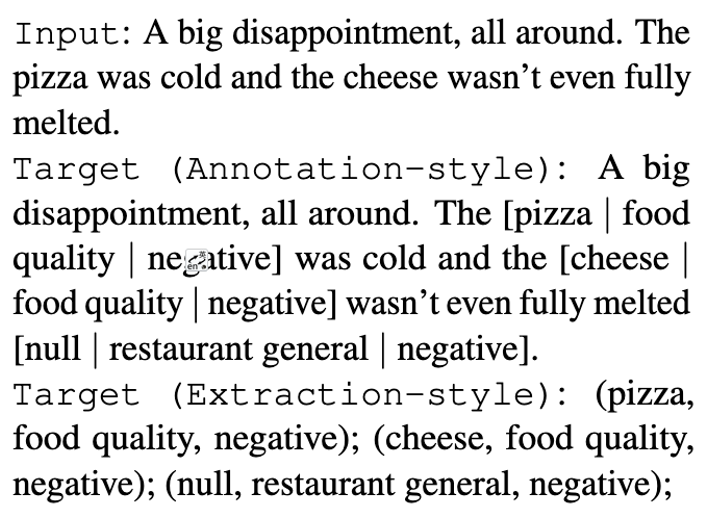
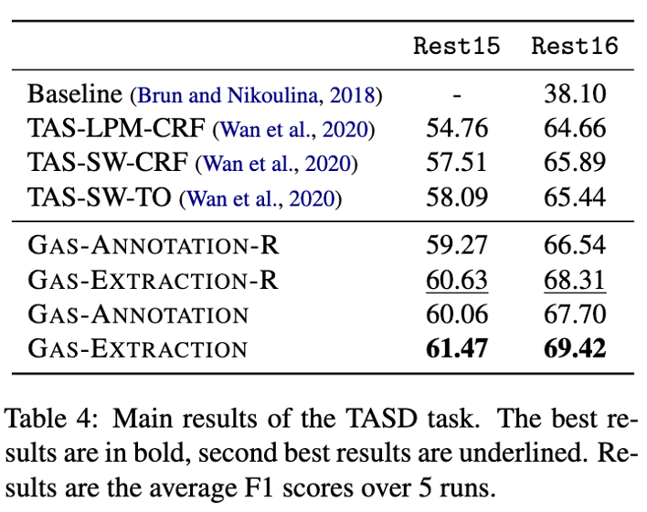

### Generation-ABSA
paper - Towards Generative Aspect-Based Sentiment Analysis (ACL 2021)

## 模型架构

将完整的ABSA任务重新定义为序列生成任务，并给出两种训练模式
分解ABSA任务为Aspect Opinion Pair Extraction (AOPE)、UnifiedABSA (UABSA), spect Sentiment Triplet Extrac-tion (ASTE), Target Aspect Sentiment Detec-tion (TASD) 任务处理，所有子任务均用同样的训练模式训练

## 模型表现

